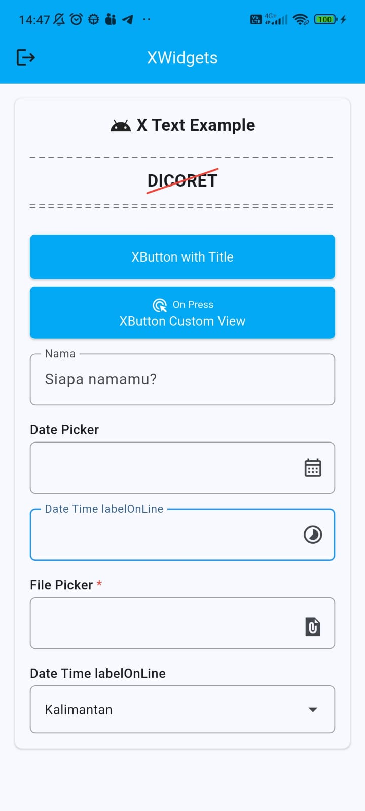

# XWidgets Pack

XWidgets is a Flutter package that provides a curated set of reusable,
customizable UI widgets to accelerate app development and improve
consistency across projects. The library focuses on lightweight, well-documented
components that are easy to style and compose.



## Features

- **XAppBar** — A configurable app bar with title, subtitle, leading and action
  slots. Supports quick theming and layout variants.
- **XButton** — Flexible button supporting primary/secondary variants, icons,
  loading states and custom styles.
- **XCard** — Styled card wrapper with padding, elevation and corner options.
- **XDiagonalStrikethroughText** — Text widget that renders a diagonal
  strikethrough for decorative or sale UI.
- **XDoubleDashedLine** — Two parallel dashed lines for decorative dividers.
- **XSingleDashedLine** — Single dashed divider with spacing and stroke options.
- **XSnackbar** — Convenience wrapper to show stylable snackbars with actions.
- **XSpacer** — Utility widget to insert flexible space between widgets.
- **XTextField** — Enhanced text field with validation hooks and prefined styles.
- **XText** — Convenience text widget consolidating common text styles.
- **XShimmer** - Wrapper widget that provides a smooth shimmer animation effect, commonly used for loading placeholders.

## Installation

Add `xwidgets` to your `pubspec.yaml` dependencies:

Or if published on pub.dev, use the latest version:

```yaml
dependencies:
  xwidgets: ^latest
```

Then run:

```bash
flutter pub get
```

## Usage

Import the package and use widgets directly:

```dart
XText(
  'X Text Example',
  icon: Icon(Icons.android),
  style: TextStyle(fontWeight: FontWeight.bold, fontSize: 18),
),

XText(
  'Long Text Example Long Text Example Long Text Example Long Text Example Long Text Example Long Text Example',
  iconVerticalAlignment: .start,
  isExpand: true,
  icon: Icon(Icons.android),
  style: TextStyle(fontWeight: FontWeight.normal, fontSize: 18),
),

// Make a static gap / spacer widget
XSpacer(height: 8),
XHeight(8),
XWidth(8),

XSingleDashedLine(),

XDiagonalStrikethroughText(
  'DICORET',
  diagonalType: .bottomTop,
  lineColor: Colors.red,
  style: TextStyle(fontWeight: FontWeight.bold, fontSize: 18),
),

XDoubleDashedLine(),

XButton(
  isLoading: isLoadingButtonTitle,
  onPressed: () async {
    setState(() => isLoadingButtonTitle = true);
    await showXButtonActionTitle();
    setState(() => isLoadingButtonTitle = false);
  },
  label: 'XButton with Title',
),

XButton(
  height: 56,
  isLoading: isLoadingButtonCustom,
  onPressed: () async {
    setState(() => isLoadingButtonCustom = true);
    await showXButtonActionCustom();
    setState(() => isLoadingButtonCustom = false);
  },
  child: Column(
    mainAxisAlignment: .center,
    children: [
      XText('On Press', style: TextStyle(fontSize: 11), icon: Icon(Icons.ads_click_rounded)),
      Text('XButton Custom View'),
    ],
  ),
),

XShimmer(
  isLoading: isLoadingShimmerCustom,
  shimmerChild: Column(
    children: [
      XShimmerChild(width: 100, height: 45),
      XSpacer(height: 10),
      XShimmerChild(width: 100, height: 45),
    ],
  ),
  child: Container(width: 100, height: 100, alignment: .center, child: Text('HelloWord')),
),

XButton(
  height: 56,
  isLoading: isLoadingShimmerCustom,
  onPressed: () async {
    setState(() => isLoadingShimmerCustom = true);
    await Future.delayed(Duration(seconds: 2));
    setState(() => isLoadingShimmerCustom = false);
  },
  child: Text('XShimmer Loading View'),
)

XTextField(labelOnLine: 'Nama', hintText: 'Siapa namamu?'),

XTextField(label: 'Date Picker', fieldType: .datepicker, suffixIcon: Icon(Icons.calendar_month_outlined)),

XTextField(
  labelOnLine: 'Date Time labelOnLine',
  fieldType: .timepicker,
  suffixIcon: Icon(Icons.timelapse_outlined)
),

XTextField(label: 'File Picker', isRequired: true, fieldType: .file)

XTextField(
  label: 'Date Time labelOnLine',
  dropdownOptions: XTextFieldDropdownOptions(
    items: ["Sumatera", 'Jawa', 'Kalimantan'],
    itemAsString: (item) => item,
  ),
  fieldType: .dropdown,
)

/// XSnackbar
/// you need init navigatorKey when run the app
///
/// MaterialApp(
///   navigatorKey: XSnackbar.navigatorKey,
///   home: MyApp(),
/// )

XSnackbar.warning(
  'XButton Pressed',
  position: .top,
  title: 'Title',
  config: XSnackbarConfig(
    radius: 0,
    leadingIcon: Icon(Icons.ac_unit_sharp, color: Colors.white),
    actionLabel: 'Tutup',
    margin: EdgeInsets.zero,
  ),
  onAction: () => debugPrint('Action Tapped'),
);
```

See the `example/` folder for more complete demos.
