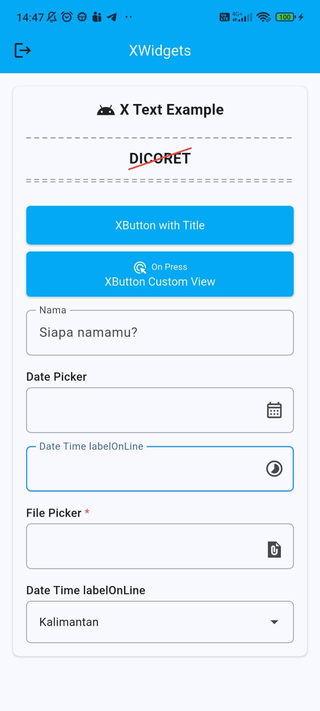

# XWidgets Pack

XWidgets is a Flutter package that provides reusable, customizable UI widgets for faster app development and consistent UI patterns.



## Features

- `XAppBar`: configurable wrapper around `AppBar` with native passthrough params.
- `XButton`: flexible button with external/inside loading, style control, and native `ElevatedButton` passthrough params.
- `XTextField`: enhanced field (normal, file, dropdown, date, time) with broad `TextFormField` passthrough params.
- `XText`: text widget with icon support, optional underline, and native `Text` passthrough params.
- `XCard`, `XSnackbar`, `XShimmer`, `XSpacer`, `XSingleDashedLine`, `XDoubleDashedLine`, `XDiagonalStrikethroughText`.

## Installation

```yaml
dependencies:
  xwidgets_pack: ^1.1.0
```

Then run:

```bash
flutter pub get
```

## Usage

```dart
import 'package:xwidgets_pack/xwidgets.dart';
```

### XButton

```dart
XButton(
  label: 'Submit',
  isLoading: isSubmitting,
  isLoadingInside: true, // keep button width while loading
  onPressed: () async {},
  style: XButtonStyle(
    loadingColor: Colors.white,
    loadingStrokeWidth: 2.5,
  ),
  elevatedButtonStyle: ElevatedButton.styleFrom(
    backgroundColor: Colors.blue,
    shape: RoundedRectangleBorder(
      borderRadius: BorderRadius.circular(12),
    ),
  ),
  onLongPress: () {},
);
```

### XTextField

```dart
XTextField(
  labelOnLine: 'Email',
  hintText: 'your@email.com',
  keyboardAppearance: Brightness.dark,
  inputFormatters: [
    FilteringTextInputFormatter.deny(RegExp(r'\s')),
  ],
  textInputAction: TextInputAction.done,
  maxLengthEnforcement: MaxLengthEnforcement.enforced,
  decoration: const InputDecoration(
    prefixIcon: Icon(Icons.email_outlined),
  ),
  onFieldSubmitted: (value) {},
  validator: (value) => value == null || value.isEmpty ? 'Required' : null,
);
```

### XAppBar

```dart
Scaffold(
  appBar: XAppBar(
    title: 'Dashboard',
    actions: [
      IconButton(onPressed: () {}, icon: const Icon(Icons.search)),
    ],
    elevation: 2,
    isTitleCenter: true,
    systemOverlayStyle: SystemUiOverlayStyle.light,
    bottom: const PreferredSize(
      preferredSize: Size.fromHeight(4),
      child: Divider(height: 1),
    ),
  ),
);
```

### XText

```dart
XText(
  'Example text',
  icon: const Icon(Icons.info_outline, size: 16),
  isUseUnderline: true,
  maxLines: 2,
  overflow: TextOverflow.ellipsis,
  textScaler: const TextScaler.linear(1.0),
  semanticsLabel: 'Example text',
  onTap: () {},
  onLongPress: () {},
);
```

See the `example/` folder for complete demos.
