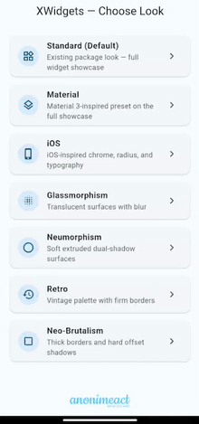
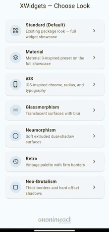
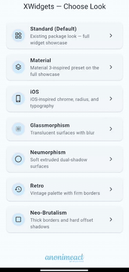
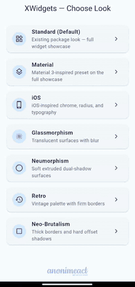
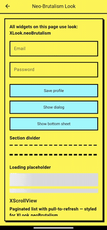

<div align="center">

# XWidgets Pack

Reusable Flutter widgets for building consistent interfaces with less
boilerplate.

[](https://flutter.dev)
[](LICENSE)
[](https://github.com/anonimeact/xwidgets)

[Getting started](#getting-started) · [Look presets](#look-presets) · [Widget catalog](#widget-catalog) ·
[UI showcase](#ui-showcase) · [Examples](#complete-examples)

</div>

---

## Table of contents

- [UI showcase](#ui-showcase)
- [Why XWidgets?](#why-xwidgets)
- [Getting started](#getting-started)
- [Look presets](#look-presets)
- [Widget catalog](#widget-catalog)
- [XAsyncView](#xasyncview)
- [XDebouncedSearchField](#xdebouncedsearchfield)
- [XResponsiveLayout](#xresponsivelayout)
- [XScrollView](#xscrollview)
- [XCollectionView](#xcollectionview)
- [XButton states](#xbutton-states)
- [XDialog and XBottomSheet](#xdialog-and-xbottomsheet)
- [XScreen](#xscreen)
- [Other examples](#other-examples)
- [Complete examples](#complete-examples)
- [License](#license)

## UI showcase

Screen recordings from the example app — each look preset applied to the same
widget set.

<table>
  <tr align="center">
    <td>
      
      <br /><strong>Standard</strong>
    </td>
    <td>
      
      <br /><strong>Material</strong>
    </td>
    <td>
      
      <br /><strong>iOS</strong>
    </td>
  </tr>
  <tr align="center">
    <td>
      
      <br /><strong>Glassmorphism</strong>
    </td>
    <td>
      
      <br /><strong>Neumorphism</strong>
    </td>
    <td>
      
      <br /><strong>Retro</strong>
    </td>
  </tr>
  <tr align="center">
    <td></td>
    <td>
      
      <br /><strong>Neo-Brutalism</strong>
    </td>
    <td></td>
  </tr>
</table>

## Why XWidgets?

XWidgets provides practical building blocks on top of Flutter's native
widgets. Each component remains configurable, composable, and independent
from a specific state-management package.

- Reusable buttons, cards, text, and app bars.
- Form validation and file, date, and dropdown fields.
- Initial loading and paginated lists.
- Empty, error, retry, refresh, and loading states.
- Shimmer, snackbar, spacing, and decorative helpers.
- Optional visual **look presets** (`standard`, `material`, `ios`, `glass`,
  `neumorphism`, `retro`, `neoBrutalism`) on visual widgets.

## Getting started

Add the package:

```yaml
dependencies:
  xwidgets_pack: ^1.3.0
```

Install dependencies and import the public library:

```bash
flutter pub get
```

```dart
import 'package:xwidgets_pack/xwidgets.dart';
```

## Look presets

Visual widgets accept an optional `look:` parameter backed by the public
`XLook` enum. The default is **`XLook.standard`**, which preserves the
existing package look. Upgrading does not change current UIs unless you opt in.

```dart
import 'package:xwidgets_pack/xwidgets.dart';

// Unchanged — same as before
XButton(label: 'Save', onPressed: onSave);

// Opt into a preset
XButton(label: 'Save', onPressed: onSave, look: XLook.ios);
XCard(look: XLook.glass, child: content);
XTextField(hintText: 'Email', look: XLook.material);
XDialog.alert(context, title: 'Hi', message: 'Hello', look: XLook.retro);
```

### Available looks

| `XLook` | Description |
| --- | --- |
| `standard` | Existing package defaults (backward-compatible) |
| `material` | Material 3-inspired shapes, tonal surfaces, and colors |
| `ios` | Large radius, light borders, low elevation |
| `glass` | Translucent fill with blur (glassmorphism) |
| `neumorphism` | Soft extruded surfaces with dual shadows |
| `retro` | Muted vintage palette with firm borders |
| `neoBrutalism` | Thick borders, hard offset shadows, high contrast |

### Supported widgets

| Widget | `look:` support |
| --- | --- |
| `XButton` | Constructor parameter |
| `XCard` | Constructor parameter |
| `XTextField` | Constructor parameter |
| `XAppBar` | Constructor parameter |
| `XText` | Constructor parameter |
| `XSingleDashedLine`, `XDoubleDashedLine` | Constructor parameter |
| `XShimmerChild` | Constructor parameter |
| `XDialog.alert`, `XDialog.confirm`, `XDialog.loading` | Method parameter |
| `XBottomSheet.show`, `XBottomSheet.actions` | Method parameter |
| `XSnackbar.info`, `success`, `error`, `warning`, `custom` | Method parameter |

Layout and behavior widgets such as `XScrollView`, `XAsyncView`,
`XSpacer`, and `XResponsiveLayout` are intentionally unchanged.

### Override rules

Look presets only fill **default visual values**. Explicit props still win:

```dart
// look sets the default radius, but radius: 24 overrides it
XButton(
  label: 'Save',
  onPressed: onSave,
  look: XLook.ios,
  radius: 24,
);

// style: overrides the look button colors
XButton(
  label: 'Save',
  onPressed: onSave,
  look: XLook.retro,
  style: XButtonStyle(background: Colors.purple),
);
```

The same rule applies to `XTextField.style`, `XCard.background`, `XAppBar.backgroundColor`,
and other explicit styling parameters.

### Dynamic look selection

Because `look` is a normal parameter, it can come from app state or config:

```dart
final look = isIosPlatform ? XLook.ios : XLook.standard;

XButton(
  label: 'Continue',
  onPressed: onContinue,
  look: look,
);
```

### Per-widget examples

**Button and card**

```dart
XButton(label: 'Primary', onPressed: onTap, look: XLook.material);
XCard(
  look: XLook.neumorphism,
  padding: const EdgeInsets.all(16),
  child: const Text('Soft card'),
);
```

**Text field and app bar**

```dart
XAppBar(title: 'Settings', look: XLook.ios);

XTextField(
  look: XLook.material,
  labelOnLine: 'Email',
  hintText: 'you@example.com',
);
```

**Overlays**

```dart
XSnackbar.success('Saved', look: XLook.glass);

await XDialog.confirm(
  context,
  title: 'Delete item?',
  message: 'This cannot be undone.',
  look: XLook.neoBrutalism,
  isDestructive: true,
);

await XBottomSheet.actions<String>(
  context,
  look: XLook.ios,
  title: 'Share',
  actions: const [
    XBottomSheetAction(label: 'Copy link', value: 'copy'),
    XBottomSheetAction(label: 'Send', value: 'send'),
  ],
);
```

**Text, dividers, and shimmer**

```dart
XText('Terms of service', look: XLook.ios, isUseUnderline: true);
const XSingleDashedLine(look: XLook.retro);
const XDoubleDashedLine(look: XLook.neoBrutalism);
const XShimmerChild(height: 48, look: XLook.glass);
```

### Tips

- **Glass** looks best on colorful backgrounds — place `XCard(look: XLook.glass)`
  over gradients or images.
- **Neumorphism** works best on a matching flat background (for example
  `Color(0xFFE0E5EC)`).
- **`XLook.standard` and `material` are different** — `standard` keeps the
  original package defaults; `material` applies a stricter Material 3-inspired
  preset.

### Runnable showcase

Open the example app and choose a look from the home screen to compare presets
on dedicated pages or open the full widget showcase for Standard and Material.

See [example/lib/look_picker_page.dart](example/lib/look_picker_page.dart) and
[example/lib/look_themed_example.dart](example/lib/look_themed_example.dart).

## Widget catalog

| Widget | Purpose |
| --- | --- |
| `XAsyncView<T>` | Standard initial, loading, data, empty, error, and retry UI |
| `XDebouncedSearchField` | Search input with debounce, clear, submit, and loading |
| `XResponsiveLayout` | Mobile, tablet, and desktop layout switching |
| `XScrollView<T>` | Vertical/horizontal lists, refresh, pagination, retry, and item interaction |
| `XCollectionView<T>` | List or grid using the same paginated data API |
| `XButton` | Configurable button with idle, loading, success, and error states; optional `look:` |
| `XDialog`, `XBottomSheet` | Typed dialogs, confirmations, loading, and action sheets; optional `look:` |
| `XScreen` | Scaffold, safe area, content width, loading, and error overlays |
| `XTextField` | Normal, file, dropdown, date, and time fields with validation; optional `look:` |
| `XAppBar` | App bar wrapper with common title, leading, and action options; optional `look:` |
| `XText` | Text with icon, underline, and tap support; optional `look:` |
| `XCard` | Consistent card layout and styling; optional `look:` |
| `XSnackbar` | Success, warning, error, and custom snackbar helpers; optional `look:` |
| `XShimmer` | Loading placeholders; `XShimmerChild` supports optional `look:` |
| `XSpacer`, `XHeight`, `XWidth` | Layout spacing shortcuts |
| Dashed lines and strikethrough text | Decorative UI helpers |

## XAsyncView

Use `XAsyncState<T>` in any state-management container and let the view choose
the correct presentation. Fetching remains outside the widget.

```dart
XAsyncState<String> userState = const XAsyncState.initial();

Future<void> loadUser() async {
  setState(() => userState = const XAsyncState.loading());
  try {
    final name = await repository.getUserName();
    setState(() {
      userState = name.isEmpty
          ? const XAsyncState.empty()
          : XAsyncState.data(name);
    });
  } catch (error, stackTrace) {
    setState(() => userState = XAsyncState.error(error, stackTrace));
  }
}

XAsyncView<String>(
  state: userState,
  onRetry: loadUser,
  loadingBuilder: (_) => const UserSkeleton(),
  emptyBuilder: (_) => const Text('No user found'),
  errorBuilder: (_, error, retry) => ErrorPanel(
    message: error.toString(),
    onRetry: retry,
  ),
  dataBuilder: (_, name) => Text('Hello, $name'),
);
```

Set `showPreviousDataWhileLoading: true` and create
`XAsyncState.loading(previousData: oldData)` to keep existing content visible
during a background reload.

## XDebouncedSearchField

The callback runs only after typing stops for the configured duration.
Asynchronous loading and stale-request indicators are handled internally;
search results remain in your own state.

```dart
XDebouncedSearchField(
  debounceDuration: const Duration(milliseconds: 400),
  minimumQueryLength: 2,
  decoration: const InputDecoration(
    hintText: 'Search products',
    prefixIcon: Icon(Icons.search),
  ),
  onSearch: (query) async {
    final products = await repository.searchProducts(query);
    setState(() => searchResults = products);
  },
  onClear: () => setState(() => searchResults = []),
  onError: (error, stackTrace) {
    debugPrint('Search failed: $error');
  },
);
```

Use an external `TextEditingController` or `FocusNode` when another state
object needs to control the field.

## XResponsiveLayout

Layouts are selected from available parent width, not only physical screen
width, so the widget also works inside panels and split-screen interfaces.

```dart
XResponsiveLayout(
  breakpoints: const XBreakpoints(
    tablet: 600,
    desktop: 1024,
  ),
  mobile: (_, constraints) => const MobileDashboard(),
  tablet: (_, constraints) => const TabletDashboard(),
  desktop: (_, constraints) => const DesktopDashboard(),
);
```

You can inspect the current category outside the widget:

```dart
final size = XResponsiveLayout.sizeOf(context);
final isDesktop = size == XResponsiveSize.desktop;
```

## XScrollView

`XScrollView<T>` owns its loading presentation while data fetching stays in
your callback. The same API works with `setState`, Provider, Riverpod, BLoC,
GetX, MobX, or a custom controller.

```dart
Future<XScrollPage<Product>> fetchProducts(XScrollRequest request) async {
  final response = await repository.getProducts(
    offset: request.offset,
    limit: request.limit,
  );

  return XScrollPage(
    items: response.products,
    hasMore: response.hasNextPage,
  );
}

XScrollView<Product>(
  pageSize: 20,
  onInit: fetchProducts,
  onLoadMore: fetchProducts,
  onItemsChanged: (items) {
    // Optional: synchronize the accumulated list to any state manager.
  },
  onItemTap: (product, index) {
    Navigator.pushNamed(context, '/product', arguments: product);
  },
  separatorBuilder: (_, _) => const Divider(height: 1),
  itemBuilder: (context, product, index) {
    return ListTile(
      title: Text(product.name),
      subtitle: Text(product.priceLabel),
    );
  },
);
```

The request contains:

| Property | Meaning |
| --- | --- |
| `page` | One-based page number |
| `offset` | Number of items already loaded |
| `limit` | Requested item count, configured through `pageSize` |
| `isRefresh` | `true` when triggered by pull-to-refresh |

`XScrollPage.hasMore` is optional. When it is omitted, the widget considers a
short page (`items.length < limit`) to be the last page.

### State and layout customization

Use the supplied builders and scroll properties to match your application:

```dart
XScrollView<Message>(
  pageSize: 15,
  paginationThreshold: 300,
  onInit: loadMessages,
  onLoadMore: loadMessages,
  loadingBuilder: (_) => const MessageListSkeleton(),
  emptyBuilder: (_) => const EmptyInbox(),
  errorBuilder: (_, error, retry) => ErrorPanel(
    message: error.toString(),
    onRetry: retry,
  ),
  paginationLoadingBuilder: (_) => const LinearProgressIndicator(),
  refreshIndicatorBuilder: (_, progress, isRefreshing) {
    return CircularProgressIndicator(
      value: isRefreshing ? null : progress,
    );
  },
  padding: const EdgeInsets.all(16),
  physics: const BouncingScrollPhysics(),
  itemBuilder: (_, message, __) => MessageTile(message: message),
);
```

Set `autoLoad: false` to display `initialItems` without calling `onInit`
automatically. Set `enableRefresh: false` to disable pull-to-refresh.

### Horizontal list

Set `scrollDirection` to use the same loading, pagination, item tap, retry, and
refresh behavior horizontally:

```dart
SizedBox(
  height: 160,
  child: XScrollView<Product>(
    scrollDirection: Axis.horizontal,
    pageSize: 10,
    onInit: fetchProducts,
    onLoadMore: fetchProducts,
    separatorBuilder: (_, _) => const VerticalDivider(width: 12),
    itemBuilder: (_, product, __) {
      return SizedBox(
        width: 140,
        child: ProductCard(product: product),
      );
    },
  ),
);
```

Pull from the leading edge to refresh a horizontal list. Use
`refreshTriggerExtent` to configure the required drag distance and
`refreshIndicatorBuilder` to replace the indicator in either direction.
Without a custom builder, vertical lists use Flutter's native
`RefreshIndicator` and horizontal lists use the built-in XScrollView
indicator.

### Custom loading indicators

Initial, pagination, and pull-to-refresh loading can be styled independently:

```dart
XScrollView<Product>(
  onInit: fetchProducts,
  onLoadMore: fetchProducts,
  loadingBuilder: (_) => const ProductListSkeleton(),
  paginationLoadingBuilder: (_) => const Padding(
    padding: EdgeInsets.all(16),
    child: Text('Loading more...'),
  ),
  refreshIndicatorBuilder: (_, progress, isRefreshing) {
    return MyRefreshIndicator(
      progress: progress,
      isRefreshing: isRefreshing,
    );
  },
  itemBuilder: (_, product, __) => ProductTile(product: product),
);
```

For a vertical list, `paginationLoadingBuilder` appears at the bottom. For a
horizontal list, the same builder appears at the right/end side. The
`progress` value passed to `refreshIndicatorBuilder` ranges from `0.0` to
`1.0`; `isRefreshing` becomes `true` while `onInit` is fetching refreshed
data.

## XCollectionView

`XCollectionView` exposes list and grid constructors while reusing the
`XScrollRequest` and `XScrollPage<T>` contract from `XScrollView`.

### Paginated list

```dart
XCollectionView<String>.list(
  pageSize: 20,
  onInit: fetchNames,
  onLoadMore: fetchNames,
  separatorBuilder: (_, _) => const Divider(height: 1),
  emptyBuilder: (_) => const Center(child: Text('No names')),
  itemBuilder: (_, name, _) => ListTile(title: Text(name)),
);
```

### Paginated grid

```dart
XCollectionView<String>.grid(
  gridDelegate: const SliverGridDelegateWithFixedCrossAxisCount(
    crossAxisCount: 2,
    mainAxisSpacing: 12,
    crossAxisSpacing: 12,
    childAspectRatio: 1.2,
  ),
  pageSize: 20,
  onInit: fetchProducts,
  onLoadMore: fetchProducts,
  emptyBuilder: (_) => const Center(child: Text('No products')),
  itemBuilder: (_, product, _) => ProductCard(product: product),
);
```

Both constructors support pull-to-refresh, custom loading/error builders,
horizontal or vertical scrolling, item taps, and `onItemsChanged`.

## XButton states

Button state is external and therefore maps directly to BLoC states, Riverpod
providers, `ChangeNotifier`, GetX controllers, or `setState`.

```dart
XButtonState saveState = XButtonState.idle;

Future<void> save() async {
  setState(() => saveState = XButtonState.loading);
  try {
    await repository.save();
    setState(() => saveState = XButtonState.success);
  } catch (_) {
    setState(() => saveState = XButtonState.error);
  }
}

XButton(
  state: saveState,
  label: 'Save',
  loadingLabel: 'Saving...',
  successLabel: 'Saved',
  errorLabel: 'Retry',
  width: double.infinity,
  onPressed: save,
);
```

Use `child`, `loadingChild`, `successChild`, or `errorChild` when each state
requires fully custom content. Existing `isLoading` and `isLoadingInside`
parameters remain supported for backward compatibility.

Combine button states with look presets when needed:

```dart
XButton(
  state: saveState,
  label: 'Save',
  look: XLook.ios,
  onPressed: save,
);
```

## XDialog and XBottomSheet

### Confirmation and alert

```dart
final confirmed = await XDialog.confirm(
  context,
  title: 'Delete item?',
  message: 'This action cannot be undone.',
  confirmLabel: 'Delete',
  isDestructive: true,
);

if (confirmed && context.mounted) {
  await repository.delete();
  await XDialog.alert(
    context,
    title: 'Deleted',
    message: 'The item was removed.',
  );
}
```

### Loading dialog

```dart
XDialog.loading<void>(
  context,
  message: 'Uploading...',
);

await repository.upload();

if (context.mounted) {
  Navigator.of(context, rootNavigator: true).pop();
}
```

### Typed action sheet

```dart
final source = await XBottomSheet.actions<String>(
  context,
  title: 'Select image source',
  actions: const [
    XBottomSheetAction(
      label: 'Camera',
      value: 'camera',
      icon: Icon(Icons.camera_alt),
    ),
    XBottomSheetAction(
      label: 'Gallery',
      value: 'gallery',
      icon: Icon(Icons.photo),
    ),
  ],
);
```

For custom content, use `XDialog.show<T>` or `XBottomSheet.show<T>`. Both
return the typed value passed to `Navigator.pop`.

Pass `look:` on alert, confirm, loading, show, and actions helpers to style
the chrome. See [Look presets](#look-presets).

## XScreen

`XScreen` combines common page behavior while preserving native `Scaffold`
slots.

```dart
XScreen(
  appBar: AppBar(title: const Text('Profile')),
  maxContentWidth: 900,
  padding: const EdgeInsets.all(16),
  isLoading: isSaving,
  error: pageError,
  onRetry: loadProfile,
  loadingBuilder: (_) => const Center(
    child: CircularProgressIndicator(),
  ),
  errorBuilder: (_, error, retry) => ErrorPanel(
    message: error.toString(),
    onRetry: retry,
  ),
  body: const ProfileForm(),
);
```

Enabled by default:

- `SafeArea` around body content.
- Keyboard dismissal when the background is tapped.
- Blocking loading overlay.
- Full-page error overlay with optional retry.
- Centered content constraint through `maxContentWidth`.

## Other examples

<details>
<summary><strong>Look presets</strong></summary>

```dart
// Default — existing package look
XButton(label: 'Save', onPressed: onSave);

// Preset looks
XButton(label: 'Save', onPressed: onSave, look: XLook.ios);
XCard(look: XLook.glass, child: const Text('Frosted card'));
XText('Headline', look: XLook.neoBrutalism);

XSnackbar.success('Saved', look: XLook.material);

await XDialog.alert(
  context,
  title: 'Notice',
  message: 'Hello from a retro dialog.',
  look: XLook.retro,
);
```

See [Look presets](#look-presets) for the full reference,
[example/lib/look_picker_page.dart](example/lib/look_picker_page.dart) for the
look selection home screen, and [example/lib/look_themed_example.dart](example/lib/look_themed_example.dart)
for dedicated themed pages.

</details>

<details>
<summary><strong>XButton</strong></summary>

```dart
XButton(
  label: 'Submit',
  isLoading: isSubmitting,
  isLoadingInside: true,
  onPressed: submit,
  style: XButtonStyle(
    loadingColor: Colors.white,
    loadingStrokeWidth: 2.5,
  ),
);
```

</details>

<details>
<summary><strong>XTextField</strong></summary>

```dart
XTextField(
  labelOnLine: 'Email',
  hintText: 'your@email.com',
  inputFormatters: [
    FilteringTextInputFormatter.deny(RegExp(r'\s')),
  ],
  textInputAction: TextInputAction.done,
  validator: (value) => value == null || value.isEmpty ? 'Required' : null,
);
```

Dropdown, file, date, and time variants use the same widget:

```dart
XTextField(
  label: 'Region',
  fieldType: XTextFieldType.dropdown,
  dropdownOptions: XTextFieldDropdownOptions(
    items: const ['Sumatra', 'Java', 'Kalimantan'],
    itemAsString: (item) => item,
  ),
  onDropdownChanged: (value) {},
);
```

</details>

<details>
<summary><strong>XAppBar</strong></summary>

```dart
Scaffold(
  appBar: XAppBar(
    title: 'Dashboard',
    actions: [
      IconButton(
        onPressed: openSearch,
        icon: const Icon(Icons.search),
      ),
    ],
  ),
);
```

</details>

<details>
<summary><strong>XText</strong></summary>

```dart
XText(
  'Account information',
  icon: const Icon(Icons.info_outline, size: 18),
  isExpand: true,
  maxLines: 2,
  overflow: TextOverflow.ellipsis,
  onTap: openAccount,
);
```

</details>

<details>
<summary><strong>XCard</strong></summary>

```dart
XCard(
  padding: const EdgeInsets.all(16),
  radius: 12,
  enableRipple: true,
  onTap: openDetails,
  child: const Text('Tap to open details'),
);
```

</details>

<details>
<summary><strong>XSnackbar</strong></summary>

Attach the navigator key once:

```dart
MaterialApp(
  navigatorKey: XSnackbar.navigatorKey,
  home: const App(),
);
```

Then show typed messages from anywhere:

```dart
XSnackbar.success('Data saved');
XSnackbar.warning(
  'Connection is unstable',
  position: XSnackbarPosition.top,
);
XSnackbar.error('Unable to save data', title: 'Error');
```

</details>

<details>
<summary><strong>XShimmer</strong></summary>

```dart
XShimmer(
  isLoading: isLoading,
  shimmerChild: const Column(
    children: [
      XShimmerChild(height: 80),
      SizedBox(height: 12),
      XShimmerChild(height: 16, width: 180),
    ],
  ),
  child: ProductDetails(product: product),
);
```

</details>

<details>
<summary><strong>XSpacer, XHeight, and XWidth</strong></summary>

```dart
Column(
  children: [
    const Text('First'),
    const XSpacer(height: 16),
    const Text('Second'),
    const XHeight(8),
  ],
);

Row(
  children: [
    const Icon(Icons.star),
    const XWidth(8),
    const Text('Favorite'),
  ],
);
```

</details>

<details>
<summary><strong>Decorative widgets</strong></summary>

```dart
const Column(
  children: [
    XSingleDashedLine(),
    XDoubleDashedLine(),
    XDiagonalStrikethroughText(
      'Rp 150.000',
      diagonalType: XDiagonalStrikethroughType.bottomTop,
      lineColor: Colors.red,
    ),
  ],
);
```

</details>

## Complete examples

See [example/lib/example_xwidgets.dart](example/lib/example_xwidgets.dart) for
the original widget showcase, including paginated `XScrollView` usage.

See [example/lib/look_picker_page.dart](example/lib/look_picker_page.dart) for the
look selection home screen and [example/lib/look_themed_example.dart](example/lib/look_themed_example.dart)
for dedicated iOS, Glass, Neumorphism, Retro, and Neo-Brutalism pages.

See [example/lib/other_widgets_example.dart](example/lib/other_widgets_example.dart)
for an executable page combining `XAsyncView`, `XDebouncedSearchField`,
`XResponsiveLayout`, `XCollectionView`, stateful `XButton`, `XDialog`,
`XBottomSheet`, and `XScreen`.

Run the example app from the package root:

```bash
cd example
flutter pub get
flutter run
```

## License

Released under the [MIT License](LICENSE).
